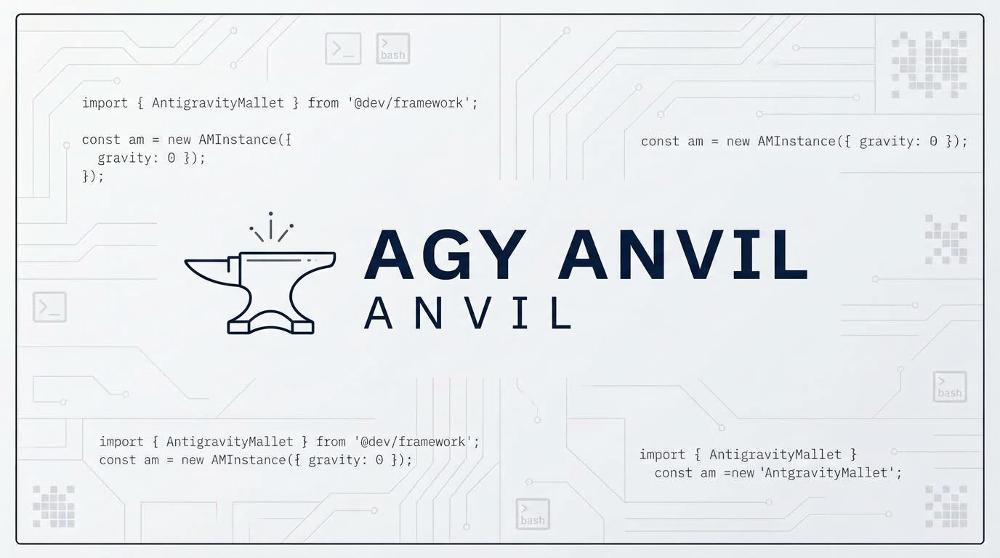

> An opinionated development framework, lifecycle hooks, and progressive skills plugin for **Google Antigravity (AGY)**.

AntigravityAnvil elevates Antigravity from an AI assistant into a rigorous, evidence-based pair-programming partner. Inspired by [Claude Mallet](https://github.com/dfsramos/claude-mallet), it is engineered from the ground up for Antigravity's native architecture: self-contained plugins, declarative lifecycle hooks, progressive skills, and isolated subagent orchestration.

---

## Features

* **Opinionated Directives (`rules/AGENTS.md`)**: Enforces evidence-based claims, fresh test verifications, surgical code editing, and clean git branching standards.
* **Declarative Lifecycle Hooks (`hooks.json`)**:
  * `PreToolUse`: Write-guard intercepts edits to `.env`, `.git/`, and lockfiles. Push-guard prevents accidental force-pushes and destructive commands.
  * `PostInvocation`: Automatically typechecks modified files and forces the agent to fix compilation errors before finishing its turn.
  * `PreInvocation`: Checks for `.anvil/` presence on turn 1 and injects orientation context.
  * `Stop`: Completion gate prevents session exit if active feature tasks remain uncompleted.
* **Progressive Skills**:
  * `/anvil-init`: Scaffolds `.anvil/` state in target projects.
  * `/anvil-discover`: Deep codebase reconnaissance and dependency mapping.
  * `/anvil-adr`: Creates Nygard-format Architecture Decision Records.
  * `/anvil-plan-feature`: Phased planning with adversarial review and Antigravity Artifact generation.
  * `/anvil-implement-feature`: Sequential task execution with fresh test verification.
  * `/anvil-systematic-debugging`: 4-phase hypothesis-driven root cause debugging.
  * `/anvil-checkpoint`: Safe pre-flight git commits.
  * `/anvil-create-pr`: Evidence-backed pull request generator.
  * `/anvil-session-review`: Retrospective updating persistent lessons learned.
* **Native Subagent Orchestration**: Pre-configured prompt templates in `agents/` for `code-analyst`, `plan-critic`, `implementer` (with worktree branching), and `code-reviewer`.
* **Zero-Intrusion Project State (`.anvil/`)**: Clean git-isolated directory for project memory, lessons, conventions, and feature plans.

---

## Installation

### Linux & macOS
```bash
git clone https://github.com/leandrop-dev/agy-anvil.git ~/.gemini/config/plugins/anvil
# OR run the installer:
cd agy-anvil
./install.sh -l   # -l creates a symlink for live development
```

### Windows (PowerShell)
```powershell
git clone https://github.com/leandrop-dev/agy-anvil.git "$HOME\.gemini\config\plugins\anvil"
# OR run the installer:
cd agy-anvil
.\install.ps1 -Link
```

### Workspace-Only Install
To install only for a specific repository:
```bash
./install.sh --workspace
# Installs into <current-dir>/.agents/plugins/anvil
```

---

## Verification

Once installed, restart the Antigravity CLI or verify plugin discovery:
```bash
agy plugin enable anvil
```

---

## Architecture & Directory Layout

```text
agy-anvil/
├── plugin.json                     # Plugin manifest
├── README.md                       # Documentation
├── install.sh / install.ps1        # Cross-platform 1-command installers
├── package.json                    # Zero-dependency metadata
├── rules/
│   └── AGENTS.md                   # Always-on operating directives
├── hooks.json                      # Hook registry
├── hooks/                          # Pure Node.js hook handlers
│   ├── write-guard.js
│   ├── push-confirm.js
│   ├── session-start.js
│   ├── typecheck.js
│   └── stop-guard.js
├── skills/                         # Progressive disclosure runbooks
│   ├── init/
│   ├── discover/
│   ├── adr/
│   ├── plan-feature/
│   ├── implement-feature/
│   ├── next-steps/
│   ├── systematic-debugging/
│   ├── checkpoint/
│   ├── create-pr/
│   └── session-review/
├── agents/                         # Prompt templates for define_subagent
│   ├── code-analyst.md
│   ├── plan-critic.md
│   ├── implementer.md
│   └── code-reviewer.md
└── templates/                      # Boilerplate for target repo .anvil/
    ├── conventions.md
    ├── memory.md
    ├── lessons.md
    └── anvil-gitignore
```

---

## License

WTFPL - Do What The Fuck You Want To Public License
